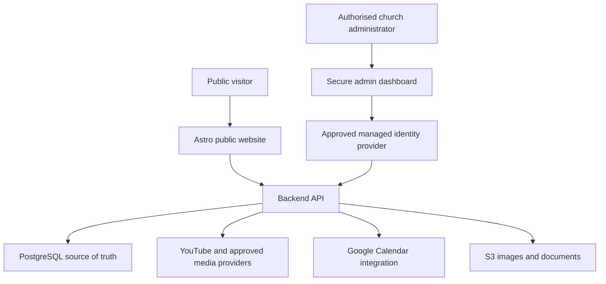
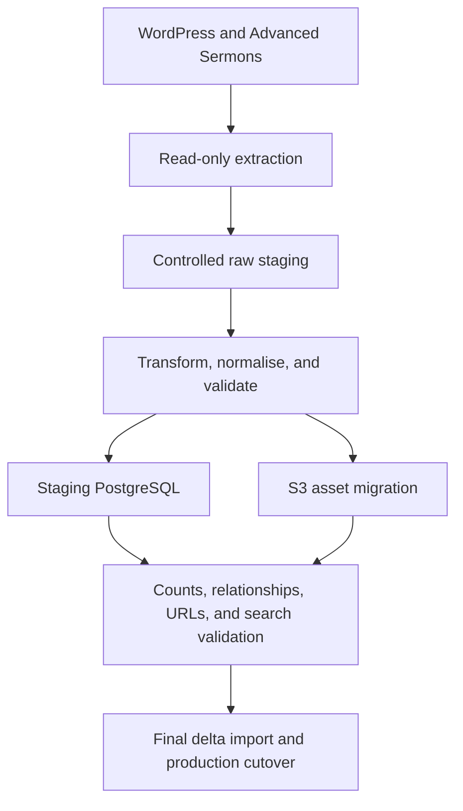
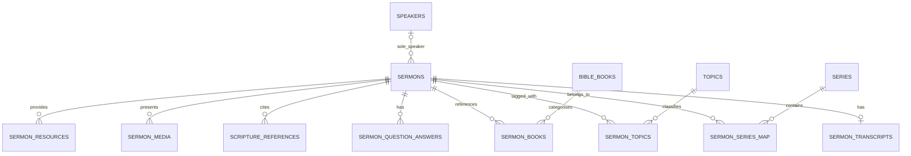
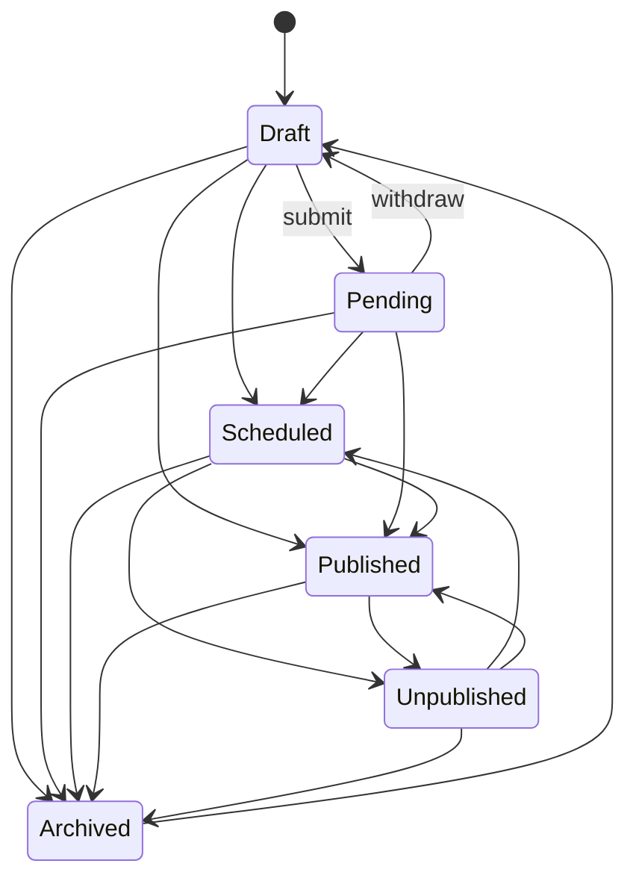
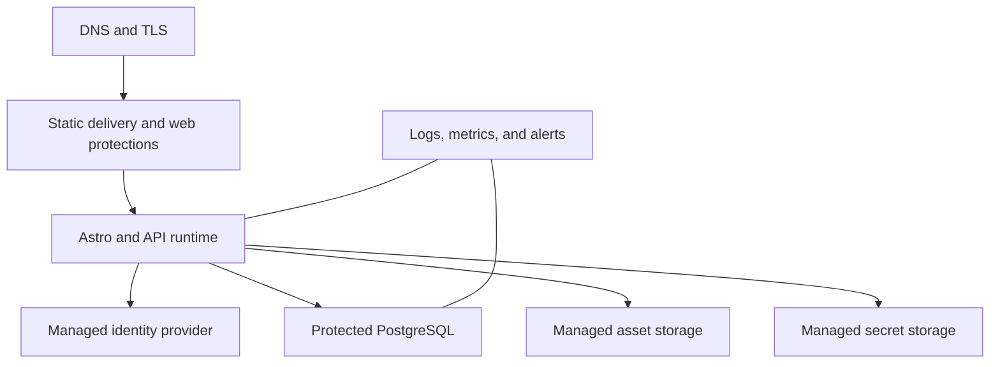

# Saving Grace Church Website Rebuild

## Technical Architecture, Advanced Sermons Migration, Security, and Delivery Plan

**Document status:** Authoritative working specification  
**Revision:** 3.0
**Updated:** 17 August 2026
**Primary audience:** Codex implementation chat, project owner, and church technical administrator  
**Purpose:** Give the implementation assistant a complete, precise account of what has been agreed, what has been discovered, what remains unknown, and how to proceed safely.

> **Phase 3B decision update (5 August 2026):** Yang has approved one active administration role, `admin`, plus safeguarded permanent deletion from `archived`. The provisional editor/contributor model and archive-only policy are superseded. The local dashboard, API, deletion tombstones, and redirect/gone dispositions use only the disposable loopback PostgreSQL target. Cognito, AWS, production adapters, deployment, real sermon imports, and every production system remain deferred and untouched.

> **Phase 3B.1 content-model decision (5 August 2026; launch count superseded 10 August):** Every sermon has exactly one speaker; a draft/imported record may be temporarily null only while incomplete. Schedule/publish still require one speaker, an approved complete transcript, five to ten ordered approved Q&A pairs, required metadata and valid controlled media. The earlier 453/453 launch count is superseded by the current 448-published-candidate direction below. The five pending records remain non-public. Real historical enrichment is incomplete and Phase 3C remains paused.

> **Phase 3B.1a approved-description decision (5 August 2026; launch count superseded 10 August):** Every public sermon requires one concise, human-reviewed and approved plain-text sermon description. `sermons.summary` remains the canonical field and the administration label is **Sermon description**; `seo_description` is a separate optional controlled override. Only approved summaries are public, searchable at weight C, or readiness-eligible. The 448 currently published candidates require approved descriptions for replacement launch; pending sermons stay unpublished unless separately approved. Migration `0005_approved_sermon_descriptions.sql` adds the minimal lifecycle/provenance metadata and approved-only search input without duplicating the summary field.

> **Phase 3B.2b administrator-review correction (6 August 2026):** Imported enrichment drafts use a dedicated one-stage-at-a-time private review route rather than the general all-in-one lifecycle form. Migration `0007_guided_sermon_review.sql` adds typed pending-by-default caption/name/Scripture decisions, transcript-version association, optimistic concurrency, audit attribution and pause/resume progress. Transcript edits invalidate earlier transcript-bound decisions. Finishing review does not submit, schedule, publish, archive or delete; the sermon remains draft/private and the human administrator retains every approval decision.

> **Phase 3B.2b atomic-preservation correction (7 August 2026):** The six aggregate prompts from migration `0007` cannot represent the 86 authoritative private findings. Migration `0008_atomic_sermon_review_items.sql` preserves exactly 42 and 44 deterministic atomic items with truthful category, stable ordinal, private detail, supporting paragraphs and transcript hash/version. Completion reconciles the exact ordered identity set; aggregate warnings never count as decisions. Every item remains pending until Samuel makes an explicit individual decision.

> **Current whole-site replacement direction (10 August 2026):** This paragraph supersedes every earlier statement that all 453 included sermon rows must be complete before public launch. The replacement will ultimately replace the complete WordPress church website, while WordPress remains live until an explicitly authorised cutover. Public launch requires the 448 currently published sermon candidates to have reviewed descriptions, transcripts, 5–10 ordered Q&A pairs, one reconciled speaker, required metadata and controlled media. The five pending sermons stay unpublished unless separately approved and do not block public launch; the three WordPress drafts remain excluded. This must never be reinterpreted as approval to publish all 453 rows.

> Continue the custom Astro/API/PostgreSQL design. The preferred production direction is a statically generated Astro public site with a separately protected administrator/API/PostgreSQL environment. Production administration must support Samuel and Yang or another authorised church administrator through individual attributable identities and MFA. The exact identity provider and other AWS services/prices remain undecided; this supersedes earlier Cognito-specific production selections, which are historical design options only. Target ongoing hosting below A$70/month where practical, and avoid NAT gateways, Fargate, RDS Proxy and Multi-AZ services unless later evidence justifies and approval authorises them. There is no fixed launch month, and frontend/whole-site work may proceed while historical review continues.

> Before replacement, inventory the whole WordPress site—including pages, forms, events, service information, staff, beliefs, giving, visitor information, calendar, SEO and URLs—and preserve verified slugs and URLs through reviewed direct redirects. Bulk migration remains repeatable extract/rehearse/delta/no-clobber work with explicit historical-speaker reconciliation, atomic findings, provenance, audit, checksums, draft isolation and production forward-only migrations backed by tested backup/restore. Keep dormant resource/media structures unless evidence shows harm. Hide scheduling controls until a real worker exists. Static `health.json` is build information, not runtime health. Social content, thumbnails, sermon-audio metadata, extra resources and advertising remain future backlog.

> **Phase 3B.2b finding-correction refinement (10 August 2026):** Stage 2 displays the exact transcript paragraphs associated by stable ordinals. A correction requires the current wording, unchanged transcript hash/version and optimistic row versions, then atomically stores original/corrected wording and attribution while changing only those paragraphs. Accept/correct removes only that finding from the active unresolved queue; sibling decision states remain intact. Full-transcript edits outside the per-finding action still invalidate transcript-bound decisions.

> **Phase 3B.2 pilot-status reconciliation (17 August 2026):** A bounded read-only query of the authorised local pilot database confirmed three private draft sermons, three completed guided reviews, approved transcripts and descriptions, 21 approved Q&A pairs, confirmed identity metadata and one canonical Bible-book assignment per sermon. The 42/44 atomic sets contain 76 accepted and ten corrected current decisions with exact administrator audit attribution; the third record has an explicit zero-finding acknowledgement. Retained private warning codes remain provenance, and nothing was published. No distinct database field or audit action records whole-pilot acceptance; that separate human decision was still outstanding at reconciliation time and is recorded by the subsequent acceptance decision below.

> **Phase 3B.2 bounded human acceptance (17 August 2026):** Samuel Saad explicitly accepts the completed Phase 3B.2 three-sermon pilot as successful evidence that the local private workflow can import existing captions, prepare readable transcripts, generate description/Q&A drafts, support detailed administrator correction and approval, retain audit evidence and keep content private pending separate publication authority. This tracked human acceptance is distinct from database approval actions and applies only to the three-sermon pilot. It does not authorise any of the remaining 450 sermons, publication of the pilot sermons, public **Related themes**, semantic recommendation quality acceptance, production access/deployment or Phase 3C.

> **Public development-dataset governance decision (1 September 2026):** Samuel Saad authorises a future public, repository-tracked curated development seed containing the church-owned frontend display content for exactly the existing 15 authenticated-preview sermons. This is a narrow exception to the former real-content-in-Git prohibition, not authority for a raw database dump, raw caption export, credential/authentication/audit material, another sermon or production data. The seed must import idempotently as draft/unpublished data and remain excluded from ordinary public routes, search, feeds, sitemaps, semantic processing and production builds. GitHub visibility does not change application publication or approval state. The governance-only milestone creates no dataset; export/import implementation and verification require a later bounded task.

> **Permanent SEO decision:** The existing website performs well in organic search. Whole-site SEO non-regression is a launch-blocking acceptance criterion for every future milestone. Preserve existing search signals at minimum, improve technical SEO safely where possible, and do not launch unless one-to-one URL, metadata, canonical, crawlability, redirect, indexability, performance, and structured-data parity is demonstrated through the process in `seo-migration-validation-plan.md`.

---

## 1. Instructions to the Codex Implementation Chat

Read this document completely before modifying application code, database schemas, infrastructure, or production content.

Treat the following categories differently:

- **Confirmed decision:** May be used as a project requirement.
- **Proposed design:** Preferred unless repository or infrastructure discovery produces a material conflict.
- **Discovery item:** Must be verified; do not silently convert it into a fact.
- **Deferred decision:** Must not block unrelated work, but must be resolved before the dependent feature is implemented.

Codex must:

1. Inspect the existing repository before choosing libraries, changing structure, or generating replacement scaffolding.
2. Inspect the existing WordPress database using the supplied read-only access before finalising the sermon schema or migration code.
3. Preserve unrelated existing code and user changes.
4. Keep all credentials, passwords, private keys, host addresses, tokens, and connection strings out of this document, the repository, logs, screenshots, and prompts.
5. Use environment variables and an approved secret store for sensitive configuration.
6. Never write to the existing WordPress database. Discovery and extraction are read-only.
7. Separate the one-time migration pipeline from the runtime architecture of the new website.
8. Implement the project as small, reversible, independently testable milestones.
9. Report architectural conflicts and material uncertainties before implementing the affected part.
10. Never switch production traffic, DNS, or data without an approved migration rehearsal, backup, validation report, and rollback plan.
11. Do not copy proprietary plugin implementation code into the new application. Recreate only approved behaviour and migrate church-owned content.
12. Do not assume that every Advanced Sermons feature is used. Inventory the current site and reproduce the subset the church confirms it needs.

This specification is not blanket permission to mutate AWS, WordPress, Google, YouTube, GitHub, DNS, or production infrastructure.

The evidence-backed migration decisions approved after Phase 0 are maintained in `decision-log.md` and the executable transformation rules in `migration-contract.md`. Those documents supersede earlier unresolved placeholders for sermon date meaning, published/pending/draft scope, and legacy-plugin inclusion.

---

## 2. Executive Summary

The church currently operates a WordPress website hosted in AWS on a Bitnami-style WordPress installation. Sermons are managed with **Advanced Sermons 3.7** plus the **Advanced Sermons Pro 2.2** add-on. The exact installed source directories were supplied and statically fingerprinted on 5 August 2026; the live database remains authoritative for populated data and settings.

The proposed replacement is a custom Astro-based website with:

- A public church website.
- A protected administration dashboard.
- An application-owned backend API.
- PostgreSQL as the durable source of truth for the replacement system.
- Server-side, indexed sermon search.
- Provider-independent administrator authentication with individual identities and MFA; the production provider remains undecided.
- Simple role-based access control.
- YouTube and other approved providers continuing to host sermon media.
- A deliberately designed events model with future Google Calendar integration.
- Hosting and supporting services in AWS.

JSON will be used only as the API transport format. It will not be the permanent sermon store, and browsers will not preload the complete sermon catalogue to perform search.

The existing WordPress database is a migration source only. It must not become a permanent runtime dependency unless the project explicitly changes direction to a headless-WordPress architecture.

---

## 3. Confirmed Decisions and Known Facts

### 3.1 Confirmed product and architecture decisions

| Area | Decision |
| --- | --- |
| Frontend direction | Build a custom website using Astro, subject to repository confirmation. |
| Hosting | Continue using AWS for the replacement system. |
| Durable data store | Use PostgreSQL for the new application. |
| JSON | Use JSON only to exchange data through the API; do not use a growing JSON file as the database. |
| Public search | Execute search server-side against indexed database fields and return paginated matches only. |
| Administration | Provide a secure dashboard for managing sermons, events, and approved website content. |
| Authentication | Use a managed provider with individual identities and MFA rather than application password storage; the exact provider remains undecided. |
| Authorisation | Use simple role-based access control from the first release. |
| Registration | No public administrator registration; accounts are invite-only/admin-created. |
| Sermon video | Continue hosting video with YouTube or the existing approved provider; store identifiers and metadata, not duplicate large video files. |
| Events | Support events in the replacement system; Google Calendar direction remains to be decided. |
| Migration | Inspect and extract the existing WordPress/Advanced Sermons data through read-only access. |
| Production cutover | Use staging, a rehearsed migration, a final delta import, validation, backups, redirects, and rollback. |
| Whole-site SEO | Preserve existing organic-search signals at minimum; SEO parity is a launch gate and unexplained regression blocks cutover. |
| Sermon date migration | Map the exact local WordPress `post_date` to preached/service date; preserve non-Sundays and flag them rather than changing them. |
| Sermon migration scope | Include published and titled pending Advanced Sermons records; exclude drafts, blank-title pending, `wp_sb_*`, and other sermon-plugin post types. |
| Sermon content completeness | Exactly one speaker, one approved sermon description, an approved full transcript, and 5–10 approved ordered Q&A pairs are required for publication; all 448 currently published candidates must pass before replacement launch. Pending rows remain unpublished/non-blocking unless separately approved. |
| Scripture conflicts | Preserve postmeta and taxonomy values with independent provenance and reconcile reversibly. |
| Media migration | Normalise YouTube and SermonAudio; never render imported embed HTML directly. |

### 3.2 Confirmed existing-system facts

- The current website is WordPress-based.
- The WordPress environment is hosted in AWS and appears to be a Bitnami deployment.
- The church uses the Advanced Sermons plugin to manage sermon content.
- The exact installed source snapshot is Advanced Sermons 3.7 plus Advanced Sermons Pro 2.2; Pro requires the free parent plugin. Licence values and licence implementation remain outside project artifacts.
- Read-only database credentials have been supplied out of band.
- A temporary external database proxy forwards a non-default public port to the internal MySQL/MariaDB port.
- Access to that proxy is restricted to the project owner's current home public IP.
- The database route was not deliberately configured with a TLS/SSL certificate.
- The church technical administrator has accepted direct temporary access through the IP-restricted proxy.
- An SSH private key was also supplied out of band but is not required for the agreed direct database connection.
- The temporary database proxy and IP allow-list should be removed when discovery and migration work are complete.
- The project owner reports that the current whole website performs well in organic search; this establishes a preservation requirement, not a guarantee that rankings can be improved or remain mechanically identical.

### 3.3 Accepted temporary risk

The existing database connection is temporary, read-only, IP-restricted, and intended solely for discovery/migration. It is not the security model for the replacement production database.

While using this temporary connection:

- Query only the data necessary to understand and migrate the website.
- Do not export WordPress users, password hashes, unrelated personal information, or secrets unless an explicit, justified requirement is approved.
- Never place credentials into command history, source code, shell scripts, screenshots, or logs.
- Verify the database account grants before inspecting content.
- Ask the administrator to remove proxy access immediately after it is no longer needed.
- If the network conditions, source IP, access scope, or risk profile changes, stop and reassess whether TLS, VPN, or an SSH tunnel is required.

The target PostgreSQL database must be private and must not copy this temporary public-proxy arrangement.

---

## 4. Goals

The replacement website should:

- Preserve or improve the public functionality the church currently relies on.
- Deliver strong mobile and desktop performance.
- Provide accessible public sermon discovery.
- Allow explicitly approved administrators to create, edit, publish, unpublish, archive, restore, and safely permanently delete sermons under the approved safeguards.
- Support fast search and filtering without client-side preloading of the whole catalogue.
- Preserve important legacy URLs, metadata, and search-engine value.
- Preserve whole-site organic-search performance at minimum through complete URL/signal mapping, server-rendered crawlable HTML, technical SEO parity, and launch-blocking validation.
- Represent sermon speakers, series, topics, books, campuses, and service types accurately.
- Allow historic records to remain valid when new metadata is introduced later.
- Provide reliable backups, monitoring, auditability, and rollback.
- Keep AWS, GitHub, Google, YouTube, analytics, and administration access individually attributable and least-privileged.
- Make content maintenance practical for non-developer church staff.

---

## 5. Non-Goals for the Initial Release

Unless later approved, do not build:

- A new video-hosting platform.
- A church member-management or pastoral-care system.
- Public user accounts or congregation profiles.
- A custom search cluster before PostgreSQL search is measured and shown to be insufficient.
- Two-way Google Calendar synchronisation without explicit conflict and ownership rules.
- A microservice architecture without an operational need.
- A public third-party API.
- A page builder attempting to replicate every WordPress editing capability.
- A copy of every Advanced Sermons visual setting or optional feature when the church does not use it.

---

## 6. Core Data Principle

```text
PostgreSQL = permanent application data and indexed search
Backend API = validation, permissions, business rules, and data access
JSON = request/response representation between components
Astro frontend = public and administrative presentation
```

JSON is not the data source. The browser must never need to download every sermon to search it.

Example runtime search:

```text
Visitor searches “holiness”
→ Astro sends a query to the backend API
→ Backend validates the query
→ PostgreSQL searches indexed published records
→ PostgreSQL ranks and paginates matches
→ API returns only the requested result page as JSON
→ Astro renders the results
```

---

## 7. Logical Runtime Architecture



### 7.1 Component boundaries

| Component | Responsibilities | Must not do |
| --- | --- | --- |
| Astro public website | Render pages, listings, detail views, search, filters, events, and media. | Connect directly to PostgreSQL from browser code. |
| Admin dashboard | Provide protected content workflows and clear validation feedback. | Treat hidden buttons as authorisation. |
| Managed identity provider (exact service undecided) | Authenticate invited administrators, manage recovery/MFA, and issue signed tokens. | Decide application business permissions alone. |
| Backend API | Verify tokens and roles, validate input, enforce state transitions, query PostgreSQL, and return controlled JSON. | Expose raw database errors or internal fields. |
| PostgreSQL | Store records, relationships, audit information, migration mappings, and indexed search documents. | Be publicly accessible in production. |
| YouTube/media providers | Host video/audio where approved. | Become the canonical store for application metadata. |
| S3 | Store optimised images, PDFs, bulletins, and approved downloadable assets. | Store application secrets or unvalidated uploads. |
| Google Calendar | Import or receive events according to the selected ownership model. | Perform undefined two-way conflict resolution. |

### 7.2 Astro implementation constraint

Astro can render static, server-rendered, or hybrid pages, but the selected AWS deployment must support the required server endpoints, authentication flow, and administrative actions.

The API may be implemented as:

- Clearly separated server modules/endpoints within the Astro application; or
- A separate Node/TypeScript API service.

The logical boundary must remain even if both layers deploy as one application. Database access, token verification, and privileged business logic remain server-only.

---

## 8. Existing Advanced Sermons Data Model

### 8.1 What is known from the plugin

Advanced Sermons uses a WordPress custom post type named `sermons` and WordPress taxonomies for sermon classification. Its published migration documentation identifies these taxonomy names:

- `sermon_series`
- `sermon_speaker`
- `sermon_topics`
- `sermon_book`
- `sermon_campus` when the campus extension is active
- `sermon_service_type` when the service-type extension is active

Published Advanced Sermons metadata keys include:

| WordPress meta key | Meaning |
| --- | --- |
| `asp_sermon_youtube` | YouTube URL |
| `asp_sermon_vimeo` | Vimeo URL |
| `asp_sermon_facebook` | Facebook video URL |
| `asp_sermon_video_embed` | Custom video embed markup |
| `asp_sermon_mp4` | Audio URL; this is a legacy field name and may contain audio formats rather than MP4 video |
| `asp_sermon_audio_embed` | Audio embed markup |
| `asp_sermon_soundcloud` | SoundCloud URL |
| `asp_sermon_bible_passage` | Display scripture/passage value |
| `asp_sermon_pdf` | Sermon notes resource |
| `asp_sermon_bulletin` | Bulletin resource |

This list is a starting point, not the final inventory. The installed plugin version, Pro edition, extensions, theme code, snippets, and historic migrations may have introduced more fields.

### 8.2 Likely WordPress storage locations

The actual table prefix is unknown and must be discovered. Advanced Sermons data is expected across standard WordPress tables:

| WordPress table class | Likely content |
| --- | --- |
| `*_posts` | Sermon title, slug, body, excerpt, dates, status, author, and attachment records. |
| `*_postmeta` | Advanced Sermons media fields, passage, featured-image relationship, views, and plugin/custom metadata. |
| `*_terms` | Speaker, series, topic, book, campus, and service-type labels/slugs. |
| `*_term_taxonomy` | Taxonomy type, hierarchy, descriptions, and counts. |
| `*_term_relationships` | Many-to-many sermon-to-taxonomy assignments. |
| `*_termmeta` | Speaker/series images, ordering, and other term-specific metadata. |
| `*_options` | Plugin version, active plugins, enabled modules, display/search settings, permalinks, and global configuration. |

Do not assume that Advanced Sermons creates no custom tables. Confirm with `SHOW TABLES` and inspect names related to sermons, analytics, views, or the plugin prefix.

### 8.3 Final church-specific cardinality decision

The source taxonomy system is structurally many-to-many, but Yang has approved a stricter replacement rule: every sermon has exactly one speaker. The runtime stores nullable `sermons.speaker_id`; null is permitted only while a draft or historical backfill is incomplete. Scheduling, publishing, and the historical launch gate require it. Migration `0004` refuses conversion and reports sermon IDs if any local join row set has more than one speaker; the importer never chooses a winner for a multi-speaker source anomaly and instead emits warning/audit evidence. Series remains many-to-many. This section supersedes the earlier generic many-speaker proposal.

---

## 9. Read-Only Discovery Procedure

### 9.1 Preconditions

Before querying:

- Use a trusted database client such as MySQL Workbench or DBeaver.
- Store the connection profile locally and securely.
- Do not save the password in repository-managed files.
- Confirm the current home public IP is still the allow-listed IP.
- Use the supplied read-only database account.
- Never enable automatic schema modification, synchronisation, or migration features in the database client.

### 9.2 Mandatory first checks

Run only read operations:

```sql
SELECT VERSION();
SELECT DATABASE();
SELECT CURRENT_USER();
SHOW GRANTS FOR CURRENT_USER;
SHOW TABLES;
```

Stop and report the issue if the account has unexpected write privileges or cannot read the required WordPress tables.

### 9.3 Discover the WordPress prefix

Identify the set of tables ending with familiar WordPress names such as `_posts`, `_postmeta`, `_options`, `_terms`, `_term_taxonomy`, and `_term_relationships`. Replace `{{wp_prefix}}` in every later query with the observed prefix.

Do not assume it is `wp`.

### 9.4 Inventory post types

```sql
SELECT post_type, post_status, COUNT(*) AS record_count
FROM {{wp_prefix}}_posts
GROUP BY post_type, post_status
ORDER BY post_type, post_status;
```

Confirm the sermon post type and its statuses. Expected post type: `sermons`.

### 9.5 Sample sermon records

```sql
SELECT
  ID,
  post_title,
  post_name,
  post_status,
  post_date,
  post_modified,
  post_excerpt,
  CHAR_LENGTH(post_content) AS content_length
FROM {{wp_prefix}}_posts
WHERE post_type = 'sermons'
ORDER BY post_date DESC
LIMIT 25;
```

Do not print full bodies or private content into logs unless needed for a controlled sample.

### 9.6 Inventory sermon metadata

```sql
SELECT
  pm.meta_key,
  COUNT(*) AS value_count,
  COUNT(DISTINCT pm.post_id) AS sermon_count
FROM {{wp_prefix}}_postmeta pm
JOIN {{wp_prefix}}_posts p ON p.ID = pm.post_id
WHERE p.post_type = 'sermons'
GROUP BY pm.meta_key
ORDER BY sermon_count DESC, pm.meta_key;
```

Then inspect small, deliberately selected samples for each relevant key. Pay special attention to:

- Every `asp_%` key
- `_thumbnail_id`
- SEO plugin keys
- View-count keys
- Podcast/feed keys
- Custom keys added by theme code or snippets
- Serialized PHP values
- Empty, duplicate, malformed, or inconsistent values

### 9.7 Inventory sermon taxonomies

```sql
SELECT
  tt.taxonomy,
  COUNT(DISTINCT tr.object_id) AS sermon_count,
  COUNT(DISTINCT tt.term_id) AS term_count
FROM {{wp_prefix}}_term_relationships tr
JOIN {{wp_prefix}}_term_taxonomy tt
  ON tt.term_taxonomy_id = tr.term_taxonomy_id
JOIN {{wp_prefix}}_posts p
  ON p.ID = tr.object_id
WHERE p.post_type = 'sermons'
GROUP BY tt.taxonomy
ORDER BY tt.taxonomy;
```

For each relevant taxonomy, inventory:

- Term IDs
- Names and slugs
- Descriptions
- Parent-child hierarchy
- Display order
- Images stored through term metadata
- Number of sermons per term
- Sermons assigned to multiple terms of the same taxonomy

### 9.8 Inspect plugin configuration

Read only the option names first:

```sql
SELECT option_name
FROM {{wp_prefix}}_options
WHERE option_name LIKE '%sermon%'
   OR option_name LIKE 'asp_%'
ORDER BY option_name;
```

Inspect relevant values cautiously. WordPress options can contain large or serialized values and may include secrets. Never paste full option dumps into the repository or chat.

Also identify:

- Active Advanced Sermons plugin edition and version where possible
- Enabled Advanced Sermons extensions
- Current sermon archive slug
- Search/filter settings
- Pagination mode
- Date behaviour
- Media-provider settings
- Default images
- View tracking
- Podcast integrations
- Template overrides
- Code-snippet or theme customisations

Plugin-file or WordPress-admin access may be required if the database does not reveal the version or custom behaviour. Ask for this only after completing the database inventory.

### 9.9 Discovery outputs

Codex should produce the following reviewable artifacts before implementing the migration:

1. `current-wordpress-sermon-inventory.md`
2. `advanced-sermons-field-map.md` or a structured CSV plus explanation
3. `target-postgresql-schema.md`
4. `search-parity-matrix.md`
5. `legacy-url-redirect-plan.md`
6. `migration-validation-plan.md`
7. `seo-migration-validation-plan.md`

Do not put credentials or raw sensitive exports in these artifacts.

---

## 10. Migration Architecture

The migration is a separate, repeatable pipeline. It is not part of every website request.



### 10.1 Extract

Extract only required entities and fields:

- Sermon posts and approved statuses
- Relevant sermon post metadata
- Sermon taxonomy terms and relationships
- Term metadata required for images/order
- Referenced attachment records and file URLs
- Relevant SEO metadata
- Legacy identifiers and URLs
- Required plugin settings for behaviour reconstruction

Do not migrate WordPress administrator passwords or password hashes. New administrators will be invited through the later-approved managed identity provider.

### 10.2 Controlled raw staging

If a raw extract must be persisted:

- Store it outside the repository.
- Encrypt it at rest.
- Restrict access.
- Record extraction time and source database identity.
- Avoid unrelated WordPress tables.
- Apply a defined retention and deletion date.

The authorised 15-sermon public development seed is not raw staging. It must be a separately verified, field-limited, exact-scope export/import artifact governed by D-148 and `AGENTS.md`; raw database dumps and raw caption/source exports remain outside the repository.

### 10.3 Transform and normalise

The transform must:

- Decode WordPress data types and controlled serialized values.
- Preserve UTF-8 characters and punctuation.
- Convert dates using the site's configured timezone and preserve original values for audit.
- Sanitize or safely transform WordPress HTML and shortcodes.
- Resolve attachment IDs to controlled media/resource records.
- Parse YouTube, Vimeo, Facebook, SoundCloud, audio, PDF, and bulletin values without discarding the original source value.
- Convert taxonomy relationships into PostgreSQL join rows.
- Preserve taxonomy hierarchy and display order.
- Generate canonical slugs only when missing or invalid.
- Detect duplicate slugs and duplicate media identifiers.
- Record rejected or ambiguous values rather than silently dropping them.
- Be idempotent: rerunning the same migration must not duplicate records.

### 10.4 Load into staging

- Run schema migrations before content migration through the fail-closed journalled runner.
- Keep schema receipts in `schema_migrations`, separate from content/import receipts. Each canonical migration has a stable order/identity and SHA-256 checksum over its normalised paired up/down definitions.
- Hold a PostgreSQL advisory lock while validating and changing schema history. Require the journal to be an exact canonical prefix with matching checksums, apply only its pending suffix, and treat a fully matching schema as a no-op.
- Record each migration's DDL and journal receipt in one transaction; remove the matching receipt in the same transaction as rollback. Never auto-baseline unjournalled application objects or accept unknown, changed, missing, duplicate or reordered history.
- Wrap entity groups in safe transactions.
- Upsert by stable migration identity, not by title.
- Never infer record equivalence from similar sermon titles alone.
- Keep migration mappings from WordPress IDs to new UUIDs.
- Generate a machine-readable migration report.

### 10.5 Verify

Verification must include:

- Total sermon counts by status
- Counts by speaker, series, topic, book, campus, and service type
- Relationship counts
- Missing titles, dates, slugs, media, and passages
- Duplicate slugs and URLs
- Featured-image and resource availability
- Representative rich-content comparison
- Old/new search result comparison
- Old/new page URL comparison
- Redirect coverage
- Random and deliberately selected record sampling
- All migration warnings and rejected values

### 10.6 Final delta and cutover

Before launch:

1. Rehearse the entire migration in staging.
2. Agree a content freeze or change-capture window.
3. Extract sermons changed since the rehearsal snapshot.
4. Apply the final idempotent delta.
5. Re-run reconciliation.
6. Back up old and new systems.
7. Deploy the application and redirects.
8. Verify critical paths before DNS changes.
9. Retain WordPress temporarily as a rollback source.
10. Remove temporary database proxy access after final acceptance.

---

## 11. Preliminary WordPress-to-PostgreSQL Field Mapping

This mapping is provisional until live database discovery is complete.

| Existing source | Proposed target | Transformation |
| --- | --- | --- |
| `posts.ID` | `migration_records.source_id` | Preserve as a string with source system/type. |
| `posts.post_title` | `sermons.title` | Preserve text; validate required length. |
| `posts.post_name` | `sermons.slug` | Preserve where valid; resolve collisions explicitly. |
| `posts.post_content` | `sermons.body` | Sanitize and transform WordPress HTML/shortcodes. |
| `posts.post_excerpt` | `sermons.summary` | Preserve or generate only with approval. |
| `posts.post_status` | `sermons.status` | Map WordPress states to draft/scheduled/published/archived. |
| `posts.post_date` | `sermons.service_date` or `published_at` | Determine actual Advanced Sermons date semantics before mapping. |
| `posts.post_modified` | `sermons.source_updated_at` | Preserve source timestamp. |
| `_thumbnail_id` | `sermons.featured_asset_id` | Resolve the referenced attachment and migrate/repoint it. |
| `asp_sermon_youtube` | `sermon_media` | Parse provider and video ID; retain source URL. |
| `asp_sermon_vimeo` | `sermon_media` | Parse Vimeo identifier and retain source URL. |
| `asp_sermon_facebook` | `sermon_media` | Preserve approved provider URL and validate embedding. |
| `asp_sermon_video_embed` | `sermon_media` | Do not copy arbitrary HTML directly; convert or sanitize deliberately. |
| `asp_sermon_mp4` | `sermon_media` | Treat as legacy audio URL unless inspection proves otherwise. |
| `asp_sermon_audio_embed` | `sermon_media` | Parse or sanitize approved audio provider data. |
| `asp_sermon_soundcloud` | `sermon_media` | Store provider, canonical URL, and optional external ID. |
| `asp_sermon_bible_passage` | `scripture_references.display_text` | Preserve exact display text; parse structured reference only when reliable. |
| `asp_sermon_pdf` | `sermon_resources` | Classify as sermon notes; migrate or retain controlled URL. |
| `asp_sermon_bulletin` | `sermon_resources` | Classify as bulletin; migrate or retain controlled URL. |
| `sermon_speaker` taxonomy | `speakers` plus nullable `sermons.speaker_id` | Preserve the sole valid assignment; report and leave null on any source anomaly rather than selecting silently. |
| `sermon_series` taxonomy | `series` plus `sermon_series_map` | Preserve terms, slugs, descriptions, images, and assignments. |
| `sermon_topics` taxonomy | `topics` plus `sermon_topics` | Preserve hierarchy and all assignments. |
| `sermon_book` taxonomy | `bible_books` plus `sermon_books` | Map to canonical Bible books while retaining source term. |
| `sermon_campus` taxonomy | `campuses` plus `sermon_campuses` | Include only if installed/used. |
| `sermon_service_type` taxonomy | `service_types` plus `sermon_service_types` | Include only if installed/used. |
| SEO plugin metadata | Sermon/page SEO fields | Identify the active SEO plugin before mapping. |
| Existing permalink | `migration_records.source_url` and `redirects` | Preserve or permanently redirect. |

---

## 12. Proposed PostgreSQL Sermon Schema

Use UUID primary keys for new application entities unless the repository already has a deliberate alternative. Every table should include appropriate timestamps and constraints. Use migrations, not ad hoc production SQL.

### 12.1 Core `sermons` table

| Column | Type/shape | Purpose |
| --- | --- | --- |
| `id` | UUID primary key | Stable application identity. |
| `title` | Text/varchar, required | Public title. |
| `slug` | Case-insensitive unique value | Canonical path component. |
| `summary` | Text, nullable only while incomplete | Visible sermon description; draft/in-review values remain private and approval is required for schedule/publish and all included launch records. |
| `body` | Text, nullable | Sanitized long-form content. |
| `status` | Controlled value | `draft`, `pending`, `scheduled`, `published`, `unpublished`, or `archived`. Permanent deletion is an operation, not a status. |
| `service_date` | Date or timestamptz | Date preached; exact type depends on source semantics. |
| `published_at` | Timestamptz, nullable | Public release time. |
| `scheduled_for` | Timestamptz, nullable | Optional future publication time. |
| `featured_asset_id` | UUID, nullable | Relationship to managed image. |
| `speaker_id` | UUID foreign key, nullable while incomplete | Sole runtime speaker; required by publication and launch readiness. |
| `historical_backfill_required` | Boolean | Derived marker for included historical records that have not passed the full checklist. |
| `transcript_search_document` | Text | Approved transcript-only lower-weight search document. |
| `question_answer_search_document` | Text | Approved Q&A-only lower-weight search document. |
| `seo_title` | Text, nullable | Explicit SEO title override. |
| `seo_description` | Text, nullable, controlled | Explicit metadata/social override; otherwise the approved visible summary is the deterministic fallback. |
| `social_title`, `social_description` | Text, nullable | Controlled social-sharing overrides; otherwise template-derived. |
| `social_image_asset_id` | UUID, nullable | Managed production-safe social image relationship. |
| `metadata` | JSONB, default `{}` | Rare, non-core attributes that do not drive normal search/filtering. |
| `source_updated_at` | Timestamptz, nullable | Last known legacy modification. |
| `created_at` / `updated_at` | Timestamptz | Application timestamps. |
| `created_by` / `updated_by` | UUID, nullable | Admin profile attribution. |
| `deleted_at` | Nullable compatibility field | Existing public queries exclude it; approved permanent deletion physically removes an archived sermon and cascade-owned content after tombstone/SEO safeguards. |
| `row_version` | Integer or equivalent | Optimistic concurrency protection. |

Core searchable/filterable data must use proper columns and relationships, not arbitrary JSONB.

SEO indexability and canonical policy are derived from route, template, environment, and publication status. Do not add arbitrary meta-name/value storage, raw `<head>` injection, unrestricted canonical URLs, or arbitrary JSON-LD. Admin contracts may expose controlled SEO/social fields and a derived preview only.

### 12.2 Classification entities and joins

#### Speakers

- `speakers`: `id`, `name`, `slug`, `biography`, `image_asset_id`, source metadata, timestamps.
- `sermons.speaker_id`: nullable foreign key while incomplete; exactly one valid speaker is mandatory before publication and for all 448 currently published launch candidates.
- `sermons.summary`: reused as the 1-2,000 character draft and 80-2,000 character approved description, with missing/draft/in-review/approved state, source type/reference, lifecycle timestamps, reviewer/approver subjects, and a summary row version. Two to four useful sentences is editorial guidance, not a mechanical rule.

#### Full transcripts and questions

- `sermon_transcripts`: one row per sermon; plain text body; `missing`, `draft`, `in_review`, or `approved`; non-secret provenance; created/updated/reviewed/approved timestamps and actors; optimistic row version; and an immutable grounding revision that rotates only when transcript bytes or source identity change.
- `sermon_question_answers`: five to ten ordered plain-text question/answer rows for readiness; `draft`, `in_review`, or `approved`; provenance, timestamps, reviewer/approver, row version, and unique `(sermon_id, display_order)`.
- `sermon_content_readiness`: derived view covering speaker, a reviewed primary-passage decision, approved description, approved transcript, 5–10 all-approved Q&As, and controlled media. A structurally valid confirmed passage or an attributed explicit no-primary decision satisfies the passage gate; missing/unreviewed passage metadata does not. A canonical Bible-book classification is informative rather than universally mandatory. The service rejects schedule/publish with field-level issues when incomplete.
- `sermon_enrichment_draft_imports`: local idempotency receipts only; imported description/transcript/Q&A content remains `draft` and requires human approval. A different import is refused when a description is already approved.

#### Series

- `series`: `id`, `name`, `slug`, `description`, `image_asset_id`, source metadata, timestamps.
- `sermon_series_map`: `sermon_id`, `series_id`, `display_order`, optional `is_primary`.

#### Topics

- `topics`: `id`, `name`, `slug`, optional `parent_id`, description, display order, timestamps.
- `sermon_topics`: `sermon_id`, `topic_id`, display order.

#### Bible books

- `bible_books`: canonical ID, canonical name, slug, testament, canonical order.
- `sermon_books`: `sermon_id`, `book_id`, display order, original source term where required.

#### Campuses and service types

Create only if live discovery confirms use:

- `campuses` and `sermon_campuses`
- `service_types` and `sermon_service_types`

### 12.3 Scripture references

`scripture_references` should support multiple references per sermon:

- `id`
- `sermon_id`
- `display_text` required
- Optional canonical `book_id`
- Optional start/end chapter and verse. Primary references may be book-only, chapter-level or verse-level; verses cannot exist without their parent chapter. A separate reviewed state records an explicit no-primary decision without inventing coordinates.
- `display_order`
- `parse_status` and original source value

Do not reject a historic sermon because a free-form passage cannot be parsed. Preserve the original display text and mark structured parsing as incomplete.

### 12.4 Media

`sermon_media`:

- `id`
- `sermon_id`
- `media_type`: video or audio
- `provider`: YouTube, Vimeo, Facebook, SoundCloud, hosted file, or approved embed
- `external_id`, nullable
- `source_url`
- `canonical_url`, nullable
- `embed_configuration`, controlled JSONB if required
- `title`, `duration_seconds`, `thumbnail_asset_id`, nullable
- `is_primary`
- `display_order`
- availability/error status
- timestamps

Never store unsanitized arbitrary embed markup for direct rendering.

### 12.5 Resources and assets

`sermon_resources`:

- `id`
- `sermon_id`
- `resource_type`: notes, bulletin, study guide, transcript download, or other approved type
- `label`
- `asset_id` or controlled external URL
- `display_order`
- timestamps

`media_assets`:

- `id`
- storage provider/key
- original filename
- content type
- size
- width/height when applicable
- checksum
- alt text
- source URL and source attachment ID
- timestamps

### 12.6 Migration and redirect records

`migration_records`:

- Source system
- Source entity type
- Source ID
- Source URL
- Target entity type
- Target UUID
- Source checksum or modification timestamp
- Migration run ID
- State: imported, skipped, rejected, or pending review
- Warning/error detail safe for logs

Unique constraint: source system + source type + source ID.

`redirects`:

- Old path, uniquely normalized
- New path
- Redirect status, normally 301
- Source/reason
- Created/verified timestamps

### 12.7 Entity relationship overview



---

## 13. Search Requirements and Design

### 13.1 Why search requires explicit parity work

Advanced Sermons may currently provide:

- Keyword search
- Date or date-range filtering
- Speaker filtering
- Series filtering
- Topic filtering
- Bible-book filtering
- Optional campus and service-type filtering
- Taxonomy exact-match behaviour
- AJAX result updates
- Numeric pagination, load-more, or infinite scrolling
- Search result counts
- Configurable archive ordering

Do not claim parity based on marketing documentation. Record exactly which behaviours are enabled and used on the church's current site.

### 13.2 Search-parity matrix

For each current search feature, document:

| Requirement | Current behaviour | Required replacement behaviour | Test cases | Status |
| --- | --- | --- | --- | --- |
| Keyword fields | To discover | Explicit title/body/etc. scope | Representative queries | Pending |
| Speaker | Single-select source UI and at most one observed assignment | Exact one-speaker filter | Every speaker slug and missing-speaker admin state | Approved |
| Series | To discover | Defined filter semantics | Multi-series sermons | Pending |
| Topic | To discover | Hierarchy behaviour | Parent/child topics | Pending |
| Bible book | To discover | Canonical mapping | Old/new testament books | Pending |
| Date | To discover | Exact/range/year semantics | Timezone boundaries | Pending |
| Pagination | To discover | Numeric/load-more choice | Stable page traversal | Pending |
| Relevance | To discover | Weighted PostgreSQL ranking | Known search set | Pending |

### 13.3 PostgreSQL search implementation

Preferred initial implementation:

- A PostgreSQL full-text search document derived from published sermon fields and relationships.
- A GIN index on the search vector.
- Weighted terms, for example:
  - Weight A: sermon title
  - Weight B: speaker, series, and scripture display text
  - Weight C: approved sermon description
  - Weight D: body plus approved transcript and approved Q&A text
- Structured SQL filters for taxonomy, date, status, and media availability.
- `pg_trgm` only if approved partial matching or typo tolerance requires it.
- Deterministic secondary sorting for equal ranks.
- Paginated responses with an enforced maximum page size.
- Optional result snippets/highlights generated safely.
- Facet counts only if required and measured.

Do not introduce AWS OpenSearch until PostgreSQL has been load-tested against realistic data and demonstrated to be insufficient.

### 13.4 Public search protections

- Search only published, non-deleted records.
- Parameterise every query.
- Rate-limit abusive request patterns.
- Normalize and length-limit input.
- Debounce frontend requests and cancel superseded requests.
- Avoid revealing draft titles through counts, suggestions, errors, or timing behaviour.
- Cache only anonymous responses safe for every visitor.

---

## 14. API Contract and JSON Compatibility

### 14.1 Compatibility principle

The database may evolve while the public API remains stable. Additive optional fields are preferred. Breaking changes require a coordinated consumer migration or a new API version.

Example:

```json
{
  "data": [
    {
      "id": "0da19fe4-8afd-4a37-8ed7-dc6b413aa605",
      "title": "The Holiness of God",
      "slug": "the-holiness-of-god",
      "serviceDate": "2026-08-02",
      "speaker": { "name": "Example Speaker", "slug": "example-speaker" },
      "series": [],
      "scriptureReferences": [
        { "displayText": "Isaiah 6:1-8" }
      ],
      "primaryMedia": {
        "provider": "youtube",
        "externalId": "example123"
      },
      "meta": {}
    }
  ],
  "pagination": {
    "page": 1,
    "pageSize": 12,
    "totalItems": 1,
    "totalPages": 1
  }
}
```

### 14.2 Rules

- Never rename a published field casually.
- New fields should normally be optional.
- Historic records may return null, empty arrays, or documented defaults.
- Frontends must tolerate missing optional data.
- Keep internal database names out of public contracts.
- Do not expose raw metadata merely because it exists in JSONB.
- Never expose credentials, audit payloads, identity-provider internals, source database details, or raw errors.
- Use `/api/v1` while the first stable contract is active.

### 14.3 Proposed public endpoints

```text
GET /api/v1/sermons
GET /api/v1/sermons/:slug
GET /api/v1/speakers
GET /api/v1/series
GET /api/v1/topics
GET /api/v1/books
GET /api/v1/events
GET /api/v1/events/:slug
```

Example search:

```http
GET /api/v1/sermons?query=holiness&speaker=example-speaker&book=isaiah&page=1&pageSize=12
```

### 14.4 Proposed protected endpoints

```text
POST   /api/v1/admin/sermons
PATCH  /api/v1/admin/sermons/:id
GET    /api/v1/admin/sermons/:id/review
PATCH  /api/v1/admin/sermons/:id/review/progress
POST   /api/v1/admin/sermons/:id/review/items/:itemId/decision
POST   /api/v1/admin/sermons/:id/review/finish
POST   /api/v1/admin/sermons/:id/submit
POST   /api/v1/admin/sermons/:id/withdraw
POST   /api/v1/admin/sermons/:id/schedule
POST   /api/v1/admin/sermons/:id/publish
POST   /api/v1/admin/sermons/:id/unpublish
POST   /api/v1/admin/sermons/:id/archive
POST   /api/v1/admin/sermons/:id/restore
POST   /api/v1/admin/sermons/:id/permanent-delete
GET    /api/v1/admin/sermons/:id/audit
GET    /api/v1/admin/audit

GET    /api/v1/admin/taxonomies/:kind
POST   /api/v1/admin/taxonomies/:kind
PATCH  /api/v1/admin/taxonomies/:kind/:id

POST   /api/v1/admin/events
PATCH  /api/v1/admin/events/:id
POST   /api/v1/admin/events/:id/publish
DELETE /api/v1/admin/events/:id
```

State-changing endpoints must be idempotent where appropriate and enforce permissions on the server. Permanent sermon deletion is a separate guarded operation: archived state, current row version, exact slug/title confirmation, reason, and required redirect/gone disposition for a previously published URL.

---

## 15. Administrator Authentication and Authorisation

### 15.1 Authentication provider

Use a managed identity provider selected through a later approved production decision. Cognito remains one historical option, not the selected service.

- Astro is the application framework, not the identity provider.
- The selected provider owns administrator identity, credential handling, recovery, MFA and token issuance.
- The application database must not store passwords or password hashes.
- Public self-registration is disabled.
- Administrators are created or invited by an authorised administrator.
- Require MFA for privileged accounts, preferably authenticator-app TOTP unless the church approves another method.
- Google sign-in may be considered later if the church wants Workspace-based sign-on; it is not required for the initial release.

### 15.2 Final administration access model

Yang has approved one active application role: `admin`. An authenticated identity is not automatically an administrator. The future identity adapter must explicitly verify that the subject has been granted administration access before returning the provider-independent admin identity.

Approved administrators may manage every sermon and relationship, perform every valid explicit transition, manage taxonomy definitions, view audit history, and invoke safeguarded permanent deletion. Editor/contributor roles, contributor ownership restrictions, role switching, and multi-role dashboard behaviour are inactive. Imported records with no local creator remain fully administrator-manageable. Default-deny every unlisted action and every unknown, unauthenticated, or unapproved identity.

Permanent deletion requires archived state, exact title/slug confirmation, current row version, reason, a transactionally retained minimal non-content tombstone, and a redirect or explicit gone disposition when the sermon was previously published. Deleted body, media, private provenance, credentials, and secrets must not survive in the tombstone.

### 15.3 Authorisation flow

```text
Administrator opens dashboard
→ Redirected to the approved managed authentication provider
→ The provider verifies identity and MFA
→ The provider issues signed tokens/session result
→ Server validates signature, issuer, audience, expiry, and token use
→ Server resolves application role from trusted claims/profile
→ Requested action is allowed or rejected
→ Material changes are written to the audit log
```

Frontend controls improve usability but never provide security. Every protected API route must independently verify identity and permission.

### 15.4 Session handling

- Prefer secure, HTTP-only, `Secure`, appropriately `SameSite` cookies.
- Avoid placing long-lived credentials in browser local storage.
- Regenerate/destroy sessions correctly at login/logout boundaries.
- Protect cookie-authenticated state changes from CSRF.
- Apply short token lifetimes with controlled refresh.
- Revoke or disable compromised accounts promptly.

---

## 16. Administration Workflows

### 16.1 Sermon lifecycle



Clients must use explicit transition operations and cannot patch status directly. Scheduling requires a future timestamp. First publication sets the publication timestamp; later unpublish, archive, restore, and republish operations preserve it. Archive/restore is the only removal model in this milestone. Permanent deletion is deferred until Yang explicitly approves authorization, retention, dependency, audit, and recovery rules.

### 16.2 Validation

Backend validation must include:

- Required and length-limited title
- Unique canonical slug
- Valid status transition
- Valid service/publication dates and explicit timezone
- Valid relationship IDs
- Approved media URL/provider parsing
- Safe rich text
- Approved file types and size limits
- Minimum publication fields
- Optimistic concurrency via row version or updated timestamp
- Clear validation responses without internal error leakage

### 16.3 Audit log

Record:

- Actor identity
- Role
- Action
- Entity type and ID
- Timestamp
- Safe before/after summary or changed field names
- Request correlation ID

Do not log tokens, passwords, private keys, raw secrets, or unnecessary personal information.

---

## 17. Events and Google Calendar

### 17.1 Proposed event model

An event should support:

- ID and slug
- Title and description
- Start/end date and time
- IANA timezone, normally `Australia/Melbourne`
- All-day indicator
- Venue and address
- Registration URL
- Featured image
- Publication status
- Recurrence data only if required
- Google Calendar external ID and synchronization metadata
- Audit and soft-deletion fields

### 17.2 Deferred source-of-truth decision

| Model | Description | Trade-off |
| --- | --- | --- |
| Google Calendar owns events | Website reads approved events from Calendar. | Simplest church workflow; weaker website-specific metadata. |
| Website owns events | Admin creates events in the new dashboard and sends them to Calendar. | Strong website control; requires reliable outbound sync. |
| Two-way sync | Either side may change events. | High complexity: conflicts, recurrence, deletions, and ownership. |

Preferred first release: choose one source of truth and implement one-way synchronization. Do not allow this unresolved decision to block sermon discovery and migration.

---

## 18. YouTube, Audio, and Downloadable Resources

### 18.1 YouTube

- Store a validated video ID and source/canonical URL.
- Do not store arbitrary embed HTML when a controlled provider embed is possible.
- Continue hosting video on YouTube.
- Optionally retrieve title, thumbnail, duration, and publication date through the YouTube API.
- Require administrator review before imported YouTube metadata overwrites church-authored values.
- Handle private, removed, embedding-disabled, and unavailable videos gracefully.

### 18.2 Other media

Preserve existing Vimeo, Facebook, SoundCloud, hosted-audio, and custom embed data during migration even if those providers are not initially displayed. Mark unsupported cases for review rather than deleting them.

### 18.3 PDFs and bulletins

- Inventory every referenced document.
- Check availability and content type.
- Migrate approved documents to controlled storage or retain approved canonical URLs.
- Preserve labels and relationship type.
- Avoid publicly exposing documents that were private or draft-only in WordPress.

---

## 19. AWS Target Architecture

The physical deployment must be chosen after inspecting the current AWS environment, traffic, operating budget, and repository. Exact AWS services remain undecided; this is a provider-neutral logical target:



### 19.1 Deployment requirements

- Production RDS PostgreSQL is not publicly accessible.
- Application-to-database access uses security-group relationships and least privilege.
- Administrator database access, when required, uses a controlled private path, SSM, VPN, or approved tunnel.
- HTTPS is enforced.
- Secrets use AWS Secrets Manager or Parameter Store, not repository files.
- Static assets use S3/CloudFront where appropriate.
- Application runtime may use the existing EC2 environment, ECS/Fargate, or another suitable AWS runtime after discovery.
- If Lambda is selected with PostgreSQL, connection management and RDS Proxy requirements must be assessed deliberately.
- Staging and production are distinct.
- Infrastructure changes should be repeatable and documented, preferably as code.
- Backups and restoration are tested, not merely enabled.

### 19.2 Existing EC2 option

If the replacement initially deploys to existing EC2:

- Use a reverse proxy such as Nginx.
- Run the application as a managed service or container with restart policies.
- Restrict inbound ports.
- Do not co-locate an externally exposed production PostgreSQL instance casually.
- Separate application and database credentials by environment.
- Use repeatable deployment steps and health checks.

---

## 20. Security Requirements

- Separate AWS IAM identities; no shared root account.
- Least-privilege IAM and application database roles.
- MFA for AWS, the selected identity-provider administrators, GitHub, WordPress, Google, and YouTube.
- Repository visibility and any real development content require an explicit owner decision. D-148 permits only the exact 15-sermon curated public development seed; all credentials, authentication material, raw sources, unrelated data and production content remain prohibited even in a private repository.
- No secret may be committed even to a private repository.
- HTTPS and secure response headers.
- Content Security Policy permitting only required YouTube/analytics resources.
- Parameterised SQL and validated input.
- Rich-text sanitisation and contextual output encoding.
- CSRF protection for cookie-authenticated mutations.
- Restrictive CORS.
- Rate limiting for authentication, search, and write endpoints.
- Safe file upload controls.
- Dependency and vulnerability scanning.
- Server-side permission checks on every protected action.
- No raw errors, stack traces, or SQL messages in production responses.
- Logs must avoid secrets and unnecessary personal information.
- Bot controls must not block legitimate search crawlers, accessibility tools, monitoring, or required integrations.

---

## 21. SEO, URLs, Analytics, and Accessibility

### 21.1 SEO and URL migration

SEO non-regression applies to the entire public website, not only sermons. The detailed, permanent validation contract is `seo-migration-validation-plan.md`.

- Establish a complete baseline of every indexable URL and search signal through a separately approved read-only crawl plus church-owned Search Console/analytics evidence where authorised.
- Preserve indexable paths/slugs wherever practical and maintain a reviewed one-to-one old/new URL disposition manifest.
- Create a direct permanent 301 for every unavoidable public URL change; prohibit redirect chains, loops, open redirects, broad homepage mappings, soft 404s, and unnecessary redirects.
- Preserve valuable titles, descriptions, headings, visible content, dates, internal links, image alt text, featured/social images, canonicals, structured data, and other established signals even when the new visual design does not use them prominently.
- Preserve sermon archive, detail, speaker, series, book, passage, query/filter compatibility, and paginated discovery according to the approved URL/search contracts.
- Render primary indexable content and important internal links as crawlable server-rendered HTML without requiring client-side JavaScript.
- Return correct `200`, `301`, `404`, `410`, and error statuses; never serve soft-error pages as `200`.
- Emit one absolute self-referencing canonical per indexable page and control duplicates from filters, search terms, tracking parameters, pagination, host/scheme/slash variants, and alternate URL forms.
- Generate valid XML sitemaps containing final canonical indexable `200` URLs only. Validate environment-specific robots directives, crawlable breadcrumbs, and accurate organisation/event/breadcrumb/video structured data.
- Keep unpublished, pending, draft, scheduled, archived, admin, search-result, preview, staging, and migration-only routes out of indexes and sitemaps. Production public pages must not inherit staging `noindex` or robots blocks.
- Preserve Open Graph/Twitter metadata and correct the observed staging-origin social-image defect before launch.
- Maintain or improve mobile performance, accessibility, Core Web Vitals, semantic HTML, and no-JavaScript content access against approved baselines/budgets.
- Block production launch when baseline coverage, crawl comparison, redirect/canonical/metadata parity, performance evidence, or reviewed exceptions are incomplete.
- Monitor Search Console, approved analytics, crawler errors, canonicals, sitemaps, structured data, and Core Web Vitals after launch using pre-agreed rollback thresholds. Do not guarantee ranking improvement.

### 21.2 Analytics

- Use church-owned Google Analytics and Tag Manager accounts.
- Avoid duplicate page-view installations.
- Document events and conversions being tracked.
- Apply appropriate privacy and consent requirements.

### 21.3 Accessibility

Target WCAG 2.2 AA practices:

- Semantic headings and landmarks
- Full keyboard access
- Visible focus indicators
- Accessible form labels and error messages
- Adequate contrast
- Meaningful alternative text
- Accessible search/filter announcements
- Accessible embedded media titles and fallbacks
- Reduced-motion support where relevant
- Responsive layouts and practical touch targets

---

## 22. Reliability, Backups, and Observability

- Automated PostgreSQL backups and point-in-time recovery according to agreed requirements.
- Restoration rehearsal into non-production.
- Versioning/retention for important S3 assets.
- Structured application logs with correlation IDs.
- Health endpoint that reveals no sensitive details.
- Monitoring for availability, latency, HTTP errors, database health, storage, and failed integrations.
- Alerting to an agreed technical contact.
- Safe forward and backward-compatible database migrations.
- Application rollback and database rollback procedures.
- Documented recovery objectives rather than invented assumptions.

---

## 23. Testing Strategy

### 23.1 Automated tests

- Unit tests for validation, slugs, permissions, media parsing, state transitions, and mapping functions.
- Integration tests against a real test PostgreSQL instance.
- API tests for visibility, filtering, ranking, pagination, validation, and the single-admin/default-deny authorization boundary.
- Migration tests using representative anonymised Advanced Sermons fixtures.
- End-to-end tests for public search and the complete administrator sermon lifecycle.
- Security tests proving unauthenticated and underprivileged users cannot mutate data.
- Redirect tests for every legacy URL mapping.
- Whole-site SEO tests for status/canonical parity, server-rendered content, robots/sitemap consistency, duplicate controls, structured data, social metadata, internal links, orphan pages, soft 404s, and performance budgets.

### 23.2 Migration tests

- Idempotent reruns
- Multi-speaker source anomaly refusal plus normal single-speaker and multiple-series cases
- Hierarchical topics
- Missing images/media
- Invalid media URLs
- Duplicate slugs
- Draft/private sermons
- Multiple scripture references
- Historic/free-form passages
- Serialized values
- Non-ASCII text
- Timezone boundaries
- Unsupported embeds retained for review
- Missing attachments

### 23.3 Manual acceptance tests

- Compare exact-title, speaker, series, topic, book, passage, keyword, and date searches with the current site.
- Verify result ranking and pagination.
- Add, edit, publish, unpublish, archive, restore, and permanently delete test sermons through the approved admin safeguards.
- Confirm older records work when optional new metadata is absent.
- Test common mobile, tablet, and desktop sizes.
- Test keyboard-only operation and major browsers.
- Validate unavailable media and integration errors.
- Crawl staging for broken links, missing images, incorrect canonical tags, and redirect gaps.
- Compare full legacy and target crawls, including rendered/no-JavaScript content, metadata, structured data, internal links, indexability, pagination, and high-value landing pages. Every material difference requires review.

---

## 24. Delivery Phases

### Phase 0 — Existing-system discovery

1. Connect to the WordPress database with the read-only account.
2. Confirm grants and table prefix.
3. Inventory Advanced Sermons post types, metadata, taxonomies, options, attachments, URLs, and counts.
4. Verify installed plugin edition/version/add-ons where possible.
5. Record actual current search behaviour.
6. Produce the discovery artifacts listed in Section 9.9.
7. Report ambiguities before finalising the target schema.

**Exit gate:** Reviewed current-system inventory, preliminary source-to-target mapping, and search-parity matrix.

### Phase 1 — Architecture and project foundation

1. Inspect the existing repository and choose the compatible Astro server/deployment approach.
2. Confirm environments and secret handling.
3. Finalise the PostgreSQL schema from discovery evidence.
4. Create migrations and a test database.
5. Establish code quality, CI, automated tests, logging, and health checks.
6. Confirm the AWS target runtime.
7. Define controlled SEO/social fields and environment-specific canonical/indexability policy without arbitrary metadata storage.

**Exit gate:** Reviewable application foundation and tested schema migrations without production changes.

### Phase 2 — Migration proof and read-only public vertical slice

1. Build an idempotent extraction/transformation pipeline.
2. Import a representative sermon set into staging PostgreSQL.
3. Implement sermon list and detail pages.
4. Implement indexed search, filters, and pagination.
5. Compare the vertical slice with the current Advanced Sermons experience.
6. Validate SEO metadata and URL strategy.
7. Prove that indexable primary content, pagination, taxonomy discovery, canonicals, headings, metadata, and internal links render server-side without JavaScript.

**Exit gate:** Demonstrated end-to-end read-only staging experience and migration report.

### Phase 3 — Authentication and administration

1. Implement and test the provider-independent local identity boundary without contacting Cognito.
2. Implement Yang's final single-admin/default-deny authorization model; remove editor/contributor and ownership-based behaviour.
3. Implement create/edit/submit/withdraw/schedule/publish/unpublish/archive/restore workflows plus safeguarded permanent deletion from archived.
4. Add server validation, audit logging, transactional relationship management, and concurrency protection.
5. Complete local security and permission tests.
6. After explicit authorisation and provider selection, configure invite-only users/MFA and a verified claims adapter for protected staging.
7. Add controlled administrator fields/previews for SEO title, description, social metadata/image, canonical path, and derived indexability; prohibit arbitrary head/meta/JSON-LD injection.
8. Build and accept the responsive accessible local `/admin` dashboard using the portable contracts, with slug-change redirects and deletion redirect/gone decisions.

**Exit gate:** Approved protected staging workflow with tested single-admin authorization, dashboard accessibility, deletion safety, and SEO dispositions.

**Local foundation status:** Provider-independent identity, Yang's final single-admin policy, sermon/taxonomy services, explicit transitions, audit, concurrency, transaction handling, deletion safeguards, URL dispositions, portable handlers, and the loopback dashboard are implemented locally. Cognito configuration, real identities, and protected staging remain future explicitly authorised work.

### Phase 3B.1 — Sermon content model and historical enrichment workflow correction

1. Replace runtime speaker joins with one nullable `speaker_id`; fail conversion on multi-speaker anomalies.
2. Add reviewed transcript and ordered reviewed Q&A models with audit/provenance and approved-only lower-weight search.
3. Derive readiness and block schedule/publish until one speaker, approved transcript, 5–10 approved Q&As, and controlled media are present.
4. Add deterministic inventory/readiness reporting, the enrichment queue, safe draft contracts, idempotent local import receipts, dashboard progress/filters/checklist, and accessible six-step editor. The former 453/453 launch interpretation is superseded by the 448-published-candidate gate.
5. Render approved transcript and Q&A in initial server HTML; collapse transcript with native `<details>` without client fetch and never emit FAQ structured data automatically.

**Verified local status:** Migration `0004`, rollback/reapply, importer rerun, repository/search/API/SSR, launch-gate, and dashboard tests pass on PostgreSQL 16.14 at the authorised loopback test target. The local three-record fixture remains intentionally incomplete. No real transcript/Q&A retrieval or production contact occurred.

**Exit gate:** Local model correction is verified and documented. Phase 3C stays paused. The next separately authorised milestone is “Phase 3B.2 — controlled historical transcript and Q&A production/review rehearsal,” which must approve providers, cost ceilings, secure source access, batch sizes, human reviewers, quality rubric, and rollback before producing any of the 453 real enrichment sets.

**Phase 3B.1a supersession:** The Phase 3B.1 exit gate above is complete but its two-output wording is superseded. Migration `0005` adds the approved description lifecycle/search/readiness requirement. Schedule/publish requires one speaker, approved description, approved transcript, 5-10 approved Q&As and controlled media. The next milestone is the three-output Phase 3B.2 rehearsal defined in Section 28A; no real description/transcript/Q&A work has begun.

### Phase 4 — Events and integrations

1. Confirm the event source of truth.
2. Implement event management and public display.
3. Implement one-way Google Calendar integration.
4. Add approved YouTube metadata assistance and resource migration.

**Exit gate:** Integrations operate predictably and failures are observable.

### Phase 5 — Full migration and launch preparation

1. Run the complete staging migration.
2. Reconcile counts, relationships, media, resources, URLs, and search.
3. Finalise redirects, sitemap, robots rules, structured data, analytics, Tag Manager, and Search Console.
4. Complete accessibility, security, performance, backup, restore, and rollback tests.
5. Train nominated administrators.
6. Approve the cutover runbook.
7. Complete the whole-site one-to-one URL inventory, old/new crawl comparison, metadata/canonical/internal-link parity report, redirect test, sitemap/robots/structured-data validation, performance budget, and SEO rollback runbook.

**Exit gate:** Signed-off acceptance report, tested rollback, and demonstrated whole-site SEO parity. Any unexplained SEO regression blocks launch.

### Phase 6 — Controlled production launch

1. Begin the agreed content freeze/change-capture window.
2. Run the final delta migration.
3. Reconcile production data.
4. Back up both systems.
5. Deploy and smoke-test application/API/admin/search/media/events.
6. Switch DNS only after approval.
7. Monitor errors, redirects, indexing, search, and integrations.
8. Retain rollback capability until stability is accepted.
9. Remove temporary legacy database access.
10. Monitor Search Console, approved analytics, crawler status/errors, sitemaps, canonicals, structured data, and Core Web Vitals against the approved SEO baseline; invoke rollback criteria when breached.

---

## 25. Current Immediate Work Plan

> **Milestone update (5 August 2026):** Phase 0, Milestones 1–2, and Phase 3 are complete; Phase 3B implements Yang's final single-admin dashboard and deletion policy locally. The steps below remain the historical discovery procedure. The permanent whole-site SEO non-regression plan uses existing artifacts only; any fresh production crawl, Search Console/analytics access, cloud work, or production contact requires separate explicit read-only authorisation.

Codex should begin with discovery, not application scaffolding.

### Step 1: Connect safely

- Use the supplied connection details outside the repository.
- Confirm the allow-listed source IP has not changed.
- Confirm account identity and grants.
- Do not run write statements.

### Step 2: Inventory Advanced Sermons

- Discover table prefix.
- Count `sermons` records by status.
- Enumerate all sermon meta keys.
- Enumerate all sermon taxonomies and relationships.
- Inspect selected samples.
- Identify media, resources, images, views, settings, plugin version/add-ons, and URL structure.

### Step 3: Produce findings

- Current schema description
- Field-by-field mapping
- Corrected target ERD/schema
- Search-parity matrix
- Migration risks and ambiguous cases
- Questions that database evidence cannot answer

### Step 4: Ask only evidence-based follow-up questions

Do not send the church administrator another broad question list before discovery. Ask follow-up questions only when:

- Connection fails.
- The account cannot read required tables.
- The plugin version or customisation cannot be identified.
- A source field has ambiguous business meaning.
- The current search behaviour cannot be determined from the website/settings.
- A product decision materially changes the schema or user experience.

### Step 5: Obtain approval for the final design

Present the discovered schema, migration map, search-parity scope, and target schema before implementing the complete migration.

---

## 26. Open Decisions and Discovery Items

| Item | Type | When required |
| --- | --- | --- |
| Exact production Astro/package versions | Local foundation decision | During Phase 1 |
| Exact production Advanced Sermons parent/Pro source version | Resolved: parent 3.7, Pro 2.2 exact installed snapshot | Complete |
| Active extensions and custom theme/snippet behaviour | Discovery | During Phase 0 |
| Actual WordPress table prefix and custom tables | Resolved: `wp_`; legacy tables excluded | Complete |
| Exact sermon date semantics | Resolved: local `post_date` is preached date | Complete |
| Fields searched and relevance behaviour | Resolved: native post search plus exact taxonomy-name matching; no plugin weighting override | Complete |
| Required plugin features versus unused features | Church decision after inventory | Before parity acceptance |
| Fresh whole-site crawl and church-owned Search Console/analytics baseline access | Explicitly approved read-only discovery | Before whole-site migration mapping and launch acceptance |
| Production canonical host/slash policy and controlled crawlable filter landing pages | SEO architecture/product decision | Before public route finalisation |
| SEO performance budgets, monitoring thresholds, and rollback authority | Church/technical decision based on measured baseline | Before Phase 5 exit |
| Target AWS runtime | Architecture decision | Phase 1 |
| Existing EC2 reuse versus new managed runtime | Architecture decision | Phase 1 |
| Event source of truth | Church decision | Before Phase 4 |
| Need for recurring events | Church decision | Before Phase 4 |
| Google federation through the selected identity provider | Deferred | Optional future enhancement |
| Backup retention and recovery objectives | Church/technical decision | Before production |
| Launch window and rollback authority | Church decision | Before Phase 6 |

---

## 27. Definition of Done for the First Production Release

The first release is complete only when:

- The complete whole-site legacy indexable URL baseline and one-to-one target disposition manifest are reviewed, with no unexplained omission.
- Existing organic-search signals are preserved at minimum and the launch-blocking crawl/metadata/canonical/redirect/indexability/performance acceptance criteria in `seo-migration-validation-plan.md` pass.
- Every unavoidable public URL change has one direct reviewed 301 to an equivalent canonical `200`; there are no chains, loops, unintended soft 404s, staging-origin metadata, or broken internal links.
- Indexable pages expose primary content through server-rendered HTML, self-canonicals, valid sitemap/robots treatment, accurate structured data, preserved social metadata, and approved mobile/accessibility/performance budgets.
- Public sermon pages and search meet the agreed current-site requirements.
- Search is PostgreSQL-backed, indexed, paginated, permission-safe, and does not preload all sermons.
- Every sermon has exactly one speaker; any multi-speaker source anomaly is reported without silent selection. Series, topics, books, and approved optional taxonomies migrate at their required cardinality.
- All 448 currently published sermon candidates pass the content gate: one reconciled speaker, approved description, approved complete transcript, 5–10 approved ordered Q&As and valid required metadata/media. The five pending rows remain unpublished/non-blocking unless separately approved.
- Required historic media and resources remain available.
- Authorised users can safely manage the sermon lifecycle according to role.
- Unauthorised users cannot access protected actions or draft data.
- Existing sermon data is migrated and reconciled.
- Important old URLs redirect correctly.
- Historic records render even when optional metadata is absent.
- The agreed events/Calendar model works without silent duplication.
- Production secrets are outside the repository.
- Production PostgreSQL is private.
- Backups, restoration, monitoring, alerting, and rollback have been tested.
- Staging is excluded from indexing.
- Analytics, Tag Manager, Search Console, YouTube, and AWS access remain church-owned and individually attributable.
- Accessibility and responsive acceptance testing is complete.
- The church has approved the result and nominated administrators are trained.
- Temporary access to the old database has been removed.
- Post-launch Search Console/approved analytics monitoring, alert thresholds, and SEO rollback authority are documented and assigned.

---

## 28. Recommended First Demonstration

Build a staging-only vertical slice after discovery:

1. Import a representative group of Advanced Sermons records, including difficult cases.
2. Display a public sermon listing.
3. Display a sermon detail page with speaker, series, scripture, media, and resources.
4. Demonstrate PostgreSQL keyword search, taxonomy filters, date filtering, and pagination.
5. Sign in through the approved managed identity provider as an authorised administrator.
6. Create and edit a draft sermon.
7. Publish it and confirm it appears in public search.
8. Archive and restore it.
9. Show the audit record and migration mapping.

This demonstration proves the architecture from legacy source through migration, PostgreSQL, API, authentication, administration, search, and public rendering before committing to production cutover.

---

## 28A. Phase 3B.1a completion and next milestone

Phase 3B.1a reuses `sermons.summary`, adds migration `0005`, and makes one approved description a permanent publication and launch criterion. The public SSR places the complete approved description below title/core metadata and before media, transcript and Q&A; it is visible, uncollapsed, escaped, and present without JavaScript. An approved explicit `seo_description` overrides metadata only, otherwise the approved visible description supplies deterministic description/social fallback. Search weights remain A title, B speaker/series/scripture/book, C approved description, and D body plus approved transcript/Q&A.

The current public-launch gate covers the 448 published candidates and requires a sole reconciled speaker, approved description, approved transcript, valid approved Q&A set and controlled media for each. The five pending rows remain unpublished/non-blocking unless separately approved; all 453 rows remain part of migration inventory. The local anonymised fixture is intentionally incomplete.

Phase 3C remains paused. The exact next milestone is **Phase 3B.2 - controlled historical description, transcript and Q&A production/review rehearsal**. It requires separate authorization for source/provider access, cost ceiling, privacy/retention terms, deterministic batches and retry/resume rules, reviewers/approvers, distinct quality rubrics for all three outputs, correction/audit evidence and rollback. Start with an approved anonymised/non-production rehearsal; do not contact a provider or produce any of the 453 real output sets under Phase 3B.1a.

### Phase 3B.2 private three-caption rehearsal outcome

The separately authorised pilot uses exactly three user-mapped local YouTube Studio text exports and no network/provider path. Migration `0006` stores private structured provenance and warning metadata without duplicating transcript content. One export had sufficient existing sentence boundaries for word-sequence-preserving cleanup and private description/transcript/seven-Q&A draft import. Two exports stopped safely with `manual_punctuation_required` and produced no derived outputs. All material remains draft, non-public and excluded from search/readiness; Codex performed no administrator approval.

Phase 3B.2b provisionally hardens the offline completion path for exactly the two records that the committed Phase 3B.2 outcome identified as `manual_punctuation_required`. Trusted source state—not caller-declared identifiers—defines that scope. Source and cleaned text are normalised to Unicode NFC and measured independently as whitespace-delimited lexical-token sequences; Unicode punctuation is removed from each token and the remainder is case-folded for comparison. Token count, boundaries, order and content must remain exact, so deletions, additions, substitutions, duplication, reordering, splitting and merging fail closed. Deterministic chunks, cryptographic hashes, exact reassembly, no-clobber filesystem persistence, structured failures, provenance retention and database/public/readiness verification are covered by anonymised tests.

No real private Phase 3B.2b captions or artifacts were inspected or processed during hardening. Private processing results, counts, import/idempotency evidence, timings and workload projections are unverified and must not be inferred from fixture tests. This hardening does not authorise the remaining 450 sermons. Before another batch, require a separately authorised private pilot rerun, administrator review of its drafts and uncertainties, explicit acceptance of its bounded verified report, an exact allowlist/batch, approved reviewers/approvers, confirmed source identities/dates, and renewed workload, privacy, retention, retry, correction, audit and rollback approval. Phase 3C remains paused.

That paragraph records the earlier implementation-only hardening milestone. Subsequent explicit private exact-two authority produced and restored both draft sets without external services, then migration `0008` preserved their 42 and 44 detailed findings. Later recorded administrator actions resolved all 86 findings, approved all three transcripts, descriptions and seven-Q&A sets, assigned the required Bible books and completed all three guided reviews while the sermons remained private drafts. Samuel Saad explicitly accepted the bounded three-sermon pilot as successfully completed on 17 August 2026. That acceptance grants no authority for another sermon or batch, publication, public **Related themes**, semantic quality acceptance, production access/deployment or Phase 3C.

### Journalled local schema execution

Local schema execution for the canonical `0001`-`0008` SQL pairs is fail closed and independent of content migration. `schema_migrations` stores stable order, identity, paired-definition checksum and application time. The runner normalises supported line endings for deterministic checksums, serialises planning and execution with a PostgreSQL advisory lock, accepts only an exact trusted journal prefix, applies only the pending suffix and performs DDL plus receipt insertion/deletion transactionally. Matching reruns are no-ops. Unknown, changed, missing, duplicate, reordered or unjournalled history blocks apply and rollback; existing objects are never silently baselined. The standalone down SQL remains available for independently controlled rollback verification.

## 29. Reference Documentation

- Advanced Sermons: <https://advancedsermons.com/>
- Advanced Sermons import and field mapping: <https://advancedsermons.com/docs/import-sermons/>
- Advanced Sermons features: <https://advancedsermons.com/features/>
- Advanced Sermons add/manage sermons: <https://advancedsermons.com/docs/add-sermons/>
- Astro authentication guide: <https://docs.astro.build/en/guides/authentication/>
- Astro sessions: <https://docs.astro.build/en/guides/sessions/>
- Amazon Cognito user pools: <https://docs.aws.amazon.com/cognito/latest/developerguide/what-is-amazon-cognito.html>
- Amazon Cognito user groups: <https://docs.aws.amazon.com/cognito/latest/developerguide/cognito-user-pools-user-groups.html>
