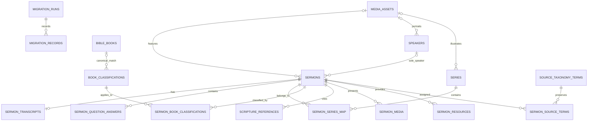

# Target PostgreSQL Schema

> **LOCAL MODEL VERIFIED — NOT APPROVED FOR PRODUCTION CREATION**

This is the reviewed migration-contract schema. It incorporates the completed read-only database inventory, Yang's approved inclusion/date/legacy decisions, the exact installed Advanced Sermons 3.7 plus Pro 2.2 source review, and Yang's final one-speaker/description/transcript/Q&A completeness decision. The ordered local SQL set is `0001`-`0008`. No production PostgreSQL object has been created.

Migration and rollback verification is restricted to the authorised disposable PostgreSQL 16 database `savinggrace_sermons_test` on loopback port 5432. Intended application relations, constraints, foreign keys, indexes, generated search vector, GIN index, `pgcrypto`, fixture loads, rollback and clean reapplication are covered by local verification. This is local evidence only and does not authorise production creation.

## Evidence-driven design conclusions

| Conclusion | Basis | Evidence |
| --- | --- | --- |
| Preserve source identity independently of target UUIDs | 456 Advanced Sermons rows plus residual sermon systems/custom tables exist | `database-observed` |
| Series must be many-to-many | Nine sermons have two `sermon_series` assignments | `database-observed` |
| Speaker is exactly one at runtime | Yang approved a sole speaker; null is temporary only for incomplete drafts/backfill, and migration refuses multiple existing assignments | `approved-decision-and-local-test-confirmed` |
| Scripture needs value plus provenance | Passage meta/taxonomy disagree on 36 published rows and only one side exists on 13 | `database-observed` |
| Book classification must allow noncanonical values | `Selected Text` and other historic classifications exist | `database-observed` |
| Campus/service-type entities are unnecessary initially | No registered term or relationship exists for either taxonomy | `database-observed` |
| Media must be provider-normalised | Live data uses 324 YouTube URLs and 424 SermonAudio iframe values | `source-and-database-confirmed` |
| Arbitrary embed HTML must not be rendered | Pro directly outputs stored audio markup; replacement security requirements prohibit this pattern | `source-confirmed` |
| Body, summary, featured image, and resources are nullable | All sermon bodies/excerpts are empty; no featured images; known resource fields are empty | `database-observed` |
| Source dates must be retained | Yang confirmed local `post_date` is the preached date; four included records are non-Sunday | `source and database confirmed` |
| Legacy counters belong in private audit | Parent mutates `post_views_count` on detail views; 453 values exist but public display is not approved | `source-and-database-confirmed` |
| Public filters must combine with AND | Direct/live behavior is AND even though a parent AJAX-prepared branch uses OR | `source-and-database-confirmed` |

## Recommended entity relationship model

`topics`, `campuses`, and `service_types` are not initial entities. Add a general `topics` model only if the church deliberately distinguishes editorial topics from scripture/passage terms. Add campus/service type only after a real data source and product requirement exist.

## Core tables

### `sermons`

| Column | PostgreSQL type | Constraints/notes |
| --- | --- | --- |
| `id` | `uuid` | Primary key generated by target system |
| `title` | `text` | Required; all source titles are present |
| `slug` | `text` | Required; case-insensitive partial unique index for non-deleted canonical sermons |
| `summary` | `text` nullable while incomplete | Reused visible sermon description; 1-2,000 characters in draft/review and 80-2,000 when approved; do not fabricate or auto-approve |
| `summary_status` and lifecycle columns | constrained text/timestamps/subjects/version | Missing/draft/in-review/approved state, source type/reference, human review/approval and optimistic concurrency |
| `body` | `text` nullable | Source is empty; future administrator content must be sanitised |
| `status` | constrained `text` | `draft`, `pending`, `scheduled`, `published`, `unpublished`, or `archived`; imported pending stays non-public |
| `service_date` | `date` | Exact local calendar date of source `post_date`; required for imported sermons |
| `published_at` | `timestamptz` nullable | Preserve/derive only under an explicit WordPress date rule |
| `scheduled_for` | `timestamptz` nullable | Target workflow field; never populate from zero draft GMT values |
| `featured_asset_id` | `uuid` nullable | No current sermon attachment source |
| `seo_description` | `text` nullable, implemented in `0005` | Controlled 1-320 character metadata/social override; current AIOSEO values are materially empty, so do not import placeholders |
| `seo_title` | `text` nullable, planned | Controlled future title override; do not import placeholders |
| `social_title`, `social_description` | `text` nullable, planned | Controlled social overrides with deterministic defaults |
| `social_image_asset_id` | `uuid` nullable, planned | Managed asset relationship; must not retain the observed staging-origin social image |
| `source_created_local`, `source_modified_local` | `timestamp without time zone` nullable | Preserve exact WordPress local values |
| `source_created_gmt`, `source_modified_gmt` | `timestamptz` nullable | Preserve valid GMT values; zero dates become null plus audit warning |
| `search_terms` | `text` | Controlled denormalised speaker/series/scripture/book document maintained server-side |
| `search_vector` | generated `tsvector` | Title A, relationships B, approved-only summary C, and body plus approved transcript/Q&A D, with GIN index |
| `created_at`, `updated_at` | `timestamptz` | Target audit timestamps |
| `created_by_subject`, `updated_by_subject` | `text` nullable | Provider-independent identity attribution; imported records remain null-owned |
| `row_version` | integer | Optimistic concurrency |
| `speaker_id` | `uuid` nullable foreign key | Sole speaker; nullable only while draft/backfill is incomplete |
| `historical_backfill_required` | boolean | Derived historical content-completeness marker |
| `transcript_search_document` | text | Approved transcript search text at weight D |
| `question_answer_search_document` | text | Approved Q&A search text at weight D |

The migration includes all 448 published records as `published` and all five titled pending records as `pending`; it excludes all three drafts. Zero pending records have blank titles. Target-created drafts/scheduled/archived records remain supported by the administration lifecycle. (`database observed`)

Legacy view counts are deliberately absent from `sermons`. `sermon_legacy_metrics` stores one private, nonnegative source counter per migrated sermon with its source key and capture timestamp. The table is migration-audit data and is excluded from public repository projections and API schemas.

The planned SEO/social columns are not part of migrations `0001`–`0003`; they require a future ordered migration and versioned admin/public contract. Canonical/indexability policy remains derived from slug, route, environment, template, and publication status rather than arbitrary metadata. Do not create general meta-name/value, raw head HTML, unrestricted canonical, or arbitrary JSON-LD storage.

### Speakers and series

- `speakers`: UUID, name, slug, biography, image asset, source/audit fields, optimistic row version.
- `sermons.speaker_id`: sole nullable speaker foreign key; schedule/publish and historical launch readiness require it.
- `series`: UUID, name, slug, description, image asset, source/audit fields, optimistic row version.
- `sermon_series_map`: sermon UUID, series UUID, display order, optional primary flag; unique pair.

Migration `0004_sermon_enrichment_readiness.sql` first aggregates the former local join table and aborts transactionally with every affected sermon UUID when any sermon has more than one speaker. It then maps only valid zero/one relationships, adds the foreign key/index, and removes the join. The importer emits an error warning and leaves the target speaker null for a multi-speaker source anomaly; it never selects one silently. The rollback restores the join representation from the sole foreign key. Series remains many-to-many. (`approved-decision-and-local-test-confirmed`)

The local reference catalogue seeds exactly seven confirmed speaker rows using deterministic UUIDs. It stores no imported historical preacher totals and assigns no sermon automatically. Administration derives distinct non-deleted relationship counts at query time; the separately labelled public count includes only complete published sermons.

### `sermon_transcripts`, `sermon_question_answers`, and readiness

- `sermon_transcripts`: one plain-text row per sermon; status `missing`, `draft`, `in_review`, or `approved`; constrained non-secret provenance; created/updated/reviewed/approved timestamps and reviewer/approver subjects; optimistic row version. HTML-like tags are rejected.
- `sermon_question_answers`: ordered plain-text rows with required nonblank question/answer, unique order 1–10 per sermon, status `draft`, `in_review`, or `approved`, provenance/review/audit fields, and row version. Readiness requires 5–10 total and every row approved.
- `sermon_content_readiness`: derived view for one speaker, approved description, approved transcript, Q&A totals/approval, controlled media, and overall completeness.
- `sermon_enrichment_draft_imports`: SHA-256 idempotency receipt for safe local draft import; it stores no transcript body and grants no approval.

Only approved summary text is copied into weight-C search input; approved transcript/Q&A text is copied at weight D. Public detail/list use summary only when approved and never expose review metadata. The portable server-rendered detail page places the uncollapsed approved description before media/transcript/Q&A, keeps the full transcript in initial HTML inside closed native `
`, and renders approved Q&A without FAQ structured data.

### Books and source taxonomy preservation

- `bible_books`: canonical book identifier, name, slug, testament, canonical order.
- `book_classifications`: UUID, source name/slug, optional canonical book ID, classification type, review state, optimistic row version.
- `sermon_book_classifications`: sermon UUID, classification UUID, display order; unique pair.
- `source_taxonomy_terms`: source system, taxonomy, source term/taxonomy IDs, name, slug, description, parent/source order, raw count, source metadata.
- `sermon_source_terms`: sermon UUID, source-term UUID, source relationship/order; unique pair.

The source layer prevents loss of `Selected Text`, unused/misclassified terms, near-duplicate series, and stored-versus-actual count discrepancies. (`database-observed`)

The canonical reference catalogue seeds all 66 `bible_books` rows in contiguous Protestant order (39 Old Testament, 27 New Testament) and one deterministic approved canonical `book_classifications` row per book. Collision-checked name/slug/abbreviation/alias resolution lets a trusted matching source term reuse that canonical classification while retaining source-term provenance. Unknown terms remain separate reviewable classifications; any ambiguous configured alias fails closed. Seeding is idempotent, grants no sermon relationship, and uses no stored legacy count as current truth.

### `scripture_references`

Recommended columns: UUID, sermon UUID, `display_text`, optional canonical book/start/end chapter/verse, `display_order`, `parse_status`, `source_kind` (`postmeta`, `taxonomy`, or curated), source term ID, and original source value.

The migration may coalesce only the 387 exact published meta/taxonomy matches while retaining both source references in audit/provenance. The 36 mismatches, 8 meta-only, 5 taxonomy-only, and 12 neither cases require null-safe, non-destructive handling. (`database-observed`)

### `sermon_media`

Recommended columns: UUID, sermon UUID, media type, controlled provider, source URL, canonical URL, external provider ID, safe embed configuration, optional title/duration/thumbnail asset, primary flag, display order, availability state, source-key/provenance, and timestamps.

Initial provider needs are YouTube and SermonAudio. Vimeo, Facebook, SoundCloud, hosted MP4, and arbitrary-video fields are registered/represented but not populated in live sermon data. (`source-and-database-confirmed`)

Do not store imported iframe markup as directly renderable public content. Retain it only in access-controlled migration evidence long enough to parse approved provider attributes, then store normalised provider data. This is a security requirement derived from the unsafe direct-output source path. (`source-confirmed`)

### Resources and assets

- `sermon_resources`: UUID, sermon UUID, controlled type, label, asset ID or validated external URL, display order, provenance, timestamps.
- `media_assets`: UUID, storage provider/key, filename, content type, size/dimensions, checksum, alt text, source URL/attachment ID, availability state, timestamps.

Current sermon PDFs, bulletins, and featured images are absent, so migration should create no empty resource/asset records. Two speaker term images resolve; one speaker image and one series image reference are broken and need explicit warnings rather than placeholder attachment rows. (`database-observed`)

## Migration, redirect, and warning tables

### `schema_migrations`

Runner-owned schema history, separate from source/content migration and draft-import receipts. Required fields are positive canonical order, unique canonical migration identity, lowercase SHA-256 checksum of the paired normalised up/down definitions, and database application timestamp. The runner accepts only an exact trusted prefix, uses an advisory lock, writes DDL and its receipt transactionally, removes the receipt transactionally with rollback, and never auto-baselines existing application objects.

### `sermon_enrichment_reviews` and `sermon_enrichment_review_items`

Migration `0007_guided_sermon_review.sql` stores only private administrator-review progress and initially seeded aggregate prompts. Migration `0008_atomic_sermon_review_items.sql` preserves the authoritative findings individually. Review state commits to source record, expected count, ordered identity-set hash and expected transcript hash/version. Each atomic item stores a deterministic identity, truthful `caption_error` or `name_or_scripture_reference` category, stable category/display ordinal, private detail, supporting paragraphs, source transcript hash, pending/accepted/corrected/left-unresolved/rejected decision, optional correction, transcript row version, decision actor/time and its own row version. Pending is the only initial state; aggregate warnings and missing decisions never imply acceptance. Transcript edits reset earlier transcript-bound decisions. These tables are admin-only and supply no public/search document.

### `migration_records`

Required fields: source system, source entity type, source ID, source URL, target type/UUID, source checksum or modified timestamp, migration run ID, state (`imported`, `skipped`, `rejected`, `pending_review`), evidence classification, and redacted warning/error detail. Unique key: source system + source entity type + source ID.

### `redirects`

Required fields: uniquely normalised old path, nullable new internal path, status (`301` normally or explicit `410` gone), source/reason, optional former sermon ID, migration-record reference, and creation/verification timestamps. A redirect requires a different internal target; a gone disposition requires `new_path IS NULL`. Validate no loop, chain, unsafe host-derived target, silent 404, or redirect for never-public pending/draft content.

### `sermon_deletion_tombstones`

Migration `0003_single_admin_deletion_seo.sql` adds a minimal non-content tombstone keyed by former sermon UUID with former slug, actor subject/role, fixed delete action, timestamp, short reason, prior-publication flag, SEO disposition, optional validated redirect target, and correlation ID. It deliberately has no sermon foreign key so the record and corresponding audit event remain valid after the sermon row is deleted. It must never store deleted title, summary, body, media, private provenance, credentials, or secrets.

### `migration_runs`

Store run UUID, code/config version, start/end, source snapshot identity without credentials, counts, outcome, and safe diagnostics. A dry run must be possible without writing production systems.

## Resolved migration scope

| Decision | Approved result | Evidence |
| --- | --- | --- |
| Advanced Sermons records | Import 448 published and 5 titled pending; exclude 3 drafts and any blank-title pending | `database observed` |
| Other sermon post types | Exclude all 12 | `database observed` |
| `wp_sb_*` tables | Exclude every row while retaining inventory documentation | `database observed` |
| Service date | Exact local `post_date`; preserve and warn on four included non-Sundays | `source and database confirmed` |
| Scripture conflicts | Preserve dual provenance; reconcile 36 conflicts and 13 one-source-only published cases | `database observed` |
| Term consolidation | Preserve first; curate only through an approved mapping | `unresolved` |
| Legacy view counts | Preserve all 453 privately; public output/display disabled | `source and database confirmed` |
| Source parity | Exact installed parent 3.7 and Pro 2.2 inspected; no semantic Pro difference detected | `source confirmed` |

## Final schema objects and boundaries

The ordered local migrations create `sermons` with its sole speaker foreign key; private `sermon_legacy_metrics`; `speakers`; `series`/`sermon_series_map`; transcripts, ordered Q&A, draft-import receipts, and readiness view; canonical Bible books and source book classifications; preserved source taxonomy terms/joins; scripture references plus immutable source rows; provider-normalised media plus private source-audit rows; nullable resources/assets; redirect/gone dispositions; migration runs/records/warnings; audit events; minimal sermon deletion tombstones; private enrichment provenance and guided-review state/items; and schema-validated namespaced sermon extensions. The runner creates and owns the separate `schema_migrations` journal.

Constraints include stable UUID identities, case-insensitive unique active slugs, explicit status/provider/outcome checks, unique join relationships, source-identity uniqueness, JSON object checks only for versioned controlled extension/embed configuration, timestamps, optimistic row versions, and indexes for visibility/date/filter joins. The full-text vector weights title highest, relationship terms next, summary next, and body lowest.

`0002_admin_foundation.sql` preserves provider-independent creator/updater audit attribution and taxonomy concurrency. `0003_single_admin_deletion_seo.sql` constrains new audit actors to `admin`/`system`, makes ownership columns non-authoritative for access, and adds reversible tombstones and redirect/gone shapes. `0004_sermon_enrichment_readiness.sql` applies the one-speaker and initial content-readiness correction. `0005_approved_sermon_descriptions.sql` reuses `summary`, adds explicit review/provenance metadata and controlled `seo_description`, replaces raw-summary search with approved-only weight C, and extends readiness. `0006_phase3b2_pilot_provenance.sql` adds private `sermon_enrichment_sources` records without duplicating transcript bodies. `0007_guided_sermon_review.sql` adds private review progress and the original aggregate prompts. `0008_atomic_sermon_review_items.sql` adds exact atomic identity/transcript expectations and removes aggregate prompts from decision counting without rewriting `0007`. No password, token, Cognito object, arbitrary postmeta, deleted content, or public private-caption text is stored in these objects.

## Historical content launch invariant

Production launch requires exactly 453 included historical rows: 453 with one speaker, 453 with an approved sermon description, 453 with approved complete transcript, 453 with 5–10 all-approved ordered Q&A pairs, 453 with required metadata/valid controlled media, 453 complete, and zero incomplete. The five titled pending records remain pending/non-public but must still pass. Three drafts, all `wp_sb_*`, and 12 older-plugin posts remain excluded. The local anonymised fixture remains intentionally incomplete. A separately authorised three-caption pilot may leave successful real material only in the disposable database as private draft evidence; it does not count toward the 453 gate until independently reviewed, correctly identity-mapped to migration records, and approved.

The exact source confirms archive/detail rewrites, date syntax/inclusivity, native keyword fields, taxonomy-name matching, AJAX triggers, and view-counter behaviour. It also exposes a direct-query `AND` versus AJAX-prepared `OR` inconsistency; the target keeps the approved, publicly observed `AND` contract and regression-tests it. Theme/site customisations outside the supplied plugin directories remain a separate acceptance concern.
